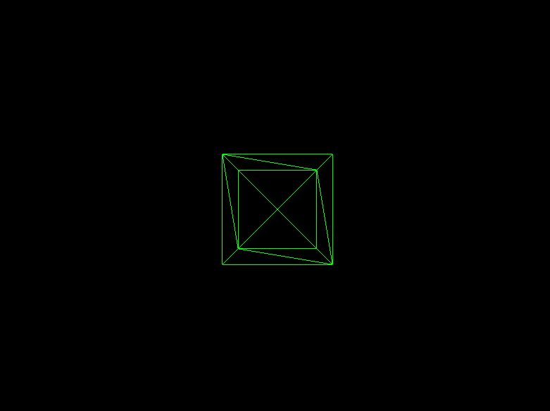

Learning three.js

<ul>
<li>have node.js installed</li>
<li>npm install vite and three</li>  
<li>set script preferences ("vite": "dev" in package.json)</li>
</ul>

Open main branch. Swap out each script located in the refs folder to check them out. You may or may not need to install a few dependancies. 

three.js has lots of controls built in. Here is "orbit control"

https://github.com/user-attachments/assets/6a61215c-392f-4ed5-99f3-591379b8bd54

Rendered wireframe:

